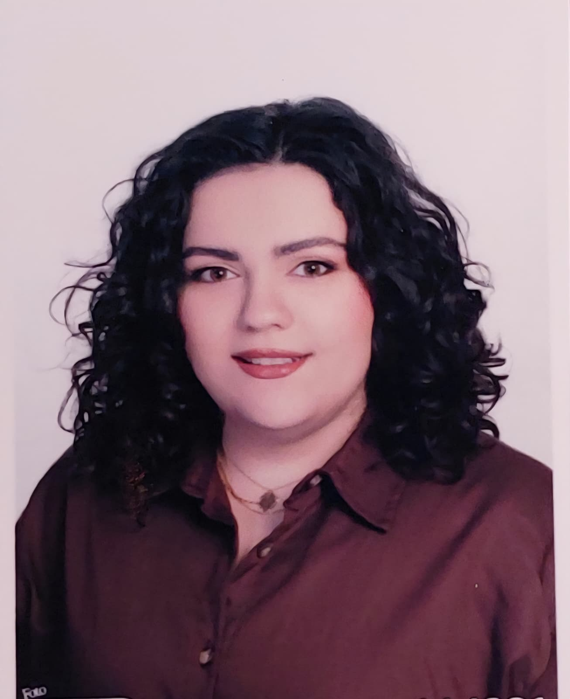

{fig-align="center" width="200px"}

# Education/Eğitim

-   M.S., Engineering Management, Hacettepe University, Turkey, 2026 - Ongoing.
    
    Yüksek Lisans, Mühendislik Yönetimi, Hacettepe Üniversitesi, Türkiye 2026 - Halen

-   B.S., Geomatics Engineering , Hacettepe University, Turkey, 2017 - 2022.
    
    Lisans, Geomatik Mühendisliği, Hacettepe Üniversitesi, Türkiye, 2017 - 2022

# Work Experience/İş Deneyimi

## Employements/Çalışan

1.  BITES Defence and Aerospace, Avionics Software Test Engineer, Apr 2025 - Ongoing
    
    BİTES Savunma ve Havacılık, Aviyonik Yazılım Test Mühendisi, Nisan 2025 - Halen

2.  SIMSOFT Computer Technologies, Avionics Software Test Engineer, May 2023 - Mar 2025
    
    SİMSOFT Bilgisayar Teknolojileri, Aviyonik Yazılım Test Mühendisi, Mayıs 2023 - Mart 2025

## Internships/Stajyer

1.  BITES Defence and Aerospace, GIS Software, Aug 2021 - Sep 2021
    
    BİTES Savunma ve Havacılık, CBS Yazılım, Ağustos 2021 - Eylül 2021

# Projects/Projeler

1.  Graduation Project, Extraction of Point Cloud-Based Information For Powerline Corridors 
    
    Bitirme Projesi, Elektrik Hattı Koridorları için Nokta Bulutu Tabanlı Bilgilerin Çıkarılması

# Publications/Yayınlar

1.  Askit, C. & Ates, D. & Bakir, I. & Seyfeli, Semanur & Ok, Ali. (2023). EXTRACTION OF POINT CLOUD-BASED INFORMATION FOR POWERLINE CORRIDORS. The International Archives of the Photogrammetry, Remote Sensing and Spatial Information Sciences. XLVIII-4/W6-2022. 41-46. 10.5194/isprs-archives-XLVIII-4-W6-2022-41-2023. 

# Certificates/Sertifikalar

ISTQB Foundatiton Level, Dec 2024

ISTQB Temel Seviye, Aralık 2024
